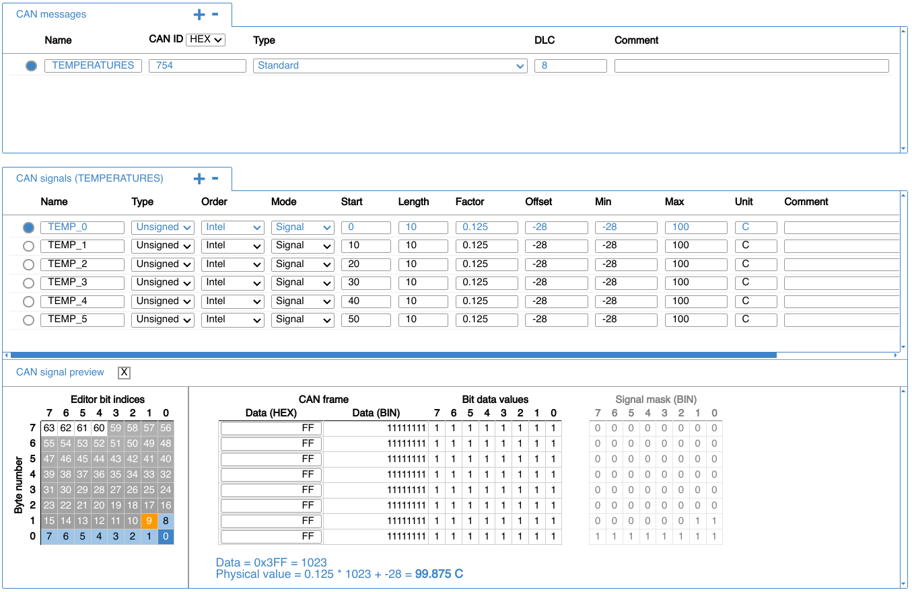

# Introduction to CAN Database Files - Zips Racing
CAN database files (or DBC files) are Zips Racing's primary method of documenting CAN bus messages. These files are responsible for describing the origin, meaning, and interpretation of every message broadcast in a CAN bus. While they are text files, DBC files are not particularly easy to read. Typically a DBC editor is used for viewing and editing a DBC file's contents. A free and easy-to-use option is CSS electronic's online editor:

https://www.csselectronics.com/pages/dbc-editor-can-bus-database

## Example DBC File
An example of a DBC file is given below:

This file only has a single message, named "TEMPERATURES". It has the CAN ID of 0x2A0, which is a standard ID. The message has a DLC of 8, meaning its payload is 8 bytes long. This message contains 6 signals, seen in the "CAN signals" section.

The first signal, is named "TEMP_0". This is an unsigned value transmitted in the Intel format (or little-endian). It starts at bit 0 and extends for 10 bits (up to bit 9). The value has a scale factor of 0.125 and an offset of -28.

If the value 0x3FF was received, it would correlate to the integer 1023 as it is unsigned. This integer is then scaled by our scale factor (0.125) to get 127.875. Lastly our offset is applied, which brings the value down to 99.875.

If the value 0x190 was received, it would correlate to 400, which is then scaled to 50, and lastly offset to 22.

The next signal, named "TEMP_1", starts immediately after the last signal at bit 10. Like the last signal, this one extends 10 bits, putting the end at bit 19. The remaining signals continue like this, up until bit 59, which is the last used bit of the payload.

The "CAN signal preview" section of the CSS DBC editor lets you experiment with conversions. The "Data (HEX)" column lets you input different bytes representing the payload. The selected CAN signal is highlighted showing what portion of the payload it occupies. The raw value after masking the remainder of the payload is shown by the "Data = ..." field. The scale factor and offset conversion is shown by the "Physical value = ..." field.

## Useful DBC Files
All DBC files for Zips Racing's vehicles are located in the [../config](../config/) directory.

For example the DBC file documenting the main CAN bus of ZR25 is located at [../config/zr25_glory/can_vehicle.dbc](../config/zr25_glory/can_vehicle.dbc)